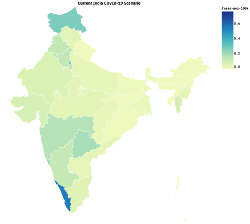
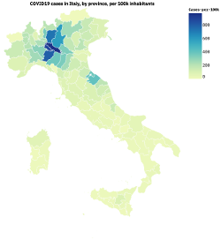

# COVID19 Visualizations in Clojure with Vega

I wanted to better understand COVID-19, so I cloned Johns Hopkins'
daily-updated dataset, fired up a Clojure REPL, and started massaging
the data into a visualization using the Vega grammar. 

This repository is a REPL notebook to **demonstrate** and **extend**
that exploration.

## Usage

A cleaned-up subset of the code I used to produce the visualizations
in the article is in the `covid19-in-the-repl` namespace. If you're
new to Clojure or just want to understand the article, I recommend
starting there:

1. Clone the [Johns Hopkins dataset
   repo](https://github.com/CSSEGISandData/COVID-19) to *resources/*
   within this repo
1. Open `appliedsciencestudio.covid19-clj-viz.covid19_in_the_repl`
1. Start a Clojure REPL (based on deps.edn, not Leiningen)
1. Evaluate forms one at a time, with a browser window open next to
   your editor so you can see the visualizatons as you go

Other namespaces are for exploring and visualizing COVID-19 data in other,
similar ways:

 - `italian-situation` replicates Alan Marazzi's article [The Italian
   COVID-19
   situation](https://alanmarazzi.gitlab.io/blog/posts/2020-3-19-italy-covid/)
   without Panthera, as a demonstration of using orthodox Clojure
 - `italia` visualizes COVID-19 cases in Italy *[contributed by David
   Schmudde]*
 - `india` visualizes COVID-19 cases in India *[contributed by Noor
   Afshan Fathima]*
 - `south-america` visualizes COVID-19 cases in South America by
   countries and in Peru by regions *[contributed by Yuliana Apaza and
   Paula Asto]*
 - `explore` is a grab-bag of general visual explorations – line & bar
   charts, choropleths
 - `china` and `deutschland` are for transforming country-specific
   data in support of visualizations
 - `source/*` namespaces are for parsing of source data (e.g. Johns
   Hopkins, the World Bank) into usable structures

    

Some namespaces depend on cloning other repos into `resources`. For
instance, we put [data from Italy's Civil Protection
Department](https://github.com/pcm-dpc/COVID-19) into
*resources/Italia-COVID-19* to support visualizations in the `italia`
and `italian-situation` namespaces.

## License

MIT License

Copyright (c) 2020 David Liepmann, Jack Rusher
